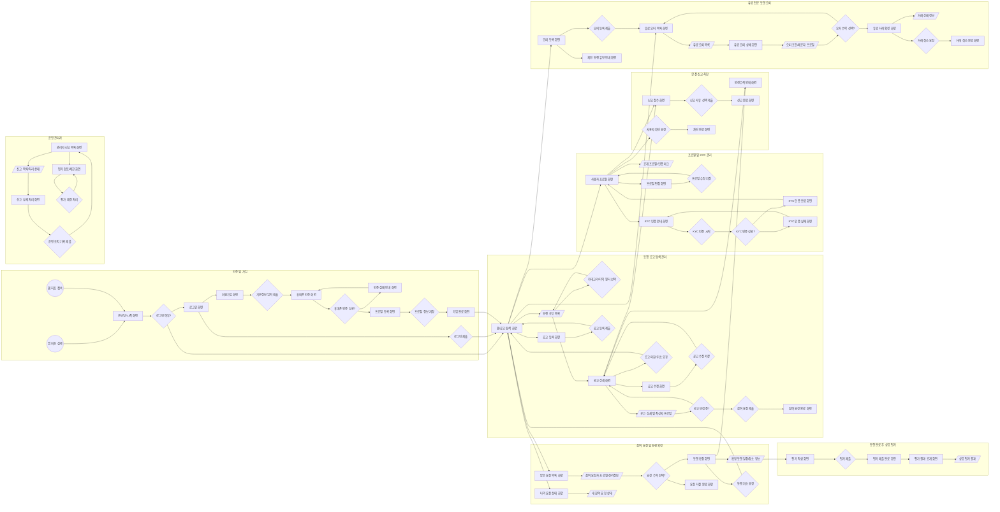

```mermaid
flowchart LR

  subgraph s1 ["인증 및 가입"]
    n1(("앱 최초 실행"))
    n2(("웹 최초 접속"))
    n3["온보딩/시작 화면"]
    n4{"로그인 여부?"}
    n5["로그인 화면"]
    n6{"로그인 제출"}
    n7["회원가입 화면"]
    n8{"기본정보 입력 제출"}
    n9["휴대폰 인증 화면"]
    n10{"휴대폰 인증 성공?"}
    n11["인증 실패 안내 화면"]
    n12["프로필 등록 화면"]
    n13{"프로필 정보 저장"}
    n14["가입 완료 화면"]
  end

  subgraph s2 ["동행 공고 탐색·관리"]
    n15["홈/공고 탐색 화면"]
    n16[/"동행 공고 목록"/]
    n17{"카테고리/지역 필터 선택"}
    n18["공고 상세 화면"]
    n19[/"공고 상세 및 작성자 프로필"/]
    n20{"공고 모집 중?"}
    n21{"참여 요청 제출"}
    n22["참여 요청 완료 화면"]
    n23["공고 등록 화면"]
    n24{"공고 등록 제출"}
    n25["공고 수정 화면"]
    n26{"공고 수정 저장"}
    n27{"공고 마감/취소 요청"}
  end

  subgraph s3 ["참여 요청 및 동행 확정"]
    n28["받은 요청 목록 화면"]
    n29[/"참여 요청자 프로필/신뢰정보"/]
    n30{"요청 수락 선택?"}
    n31["동행 확정 화면"]
    n32[/"확정 동행 일정/장소 정보"/]
    n33{"동행 취소 요청"}
    n34["요청 거절 완료 화면"]
    n35["나의 요청 상태 화면"]
    n36[/"내 참여 요청 상태"/]
  end

  subgraph s4 ["동행 완료 후 상호 평가"]
    n37["평가 작성 화면"]
    n38{"평가 제출"}
    n39["평가 제출 완료 화면"]
    n40["평가 결과 공개 화면"]
    n41[/"상호 평가 결과"/]
  end

  subgraph s5 ["프로필 및 KYC 관리"]
    n42["사용자 프로필 화면"]
    n43[/"공개 프로필/인증 마크"/]
    n44["프로필 편집 화면"]
    n45{"프로필 수정 저장"}
    n46["KYC 인증 안내 화면"]
    n47{"KYC 인증 시작"}
    n48{"KYC 인증 성공?"}
    n49["KYC 인증 완료 화면"]
    n50["KYC 인증 실패 화면"]
  end

  subgraph s6 ["안전·신고·차단"]
    n51["안전수칙 안내 화면"]
    n52["신고 접수 화면"]
    n53{"신고 사유 선택 제출"}
    n54["신고 완료 화면"]
    n55{"사용자 차단 요청"}
    n56["차단 완료 화면"]
  end

  subgraph s7 ["유료 전문 동행 오퍼"]
    n57["유료 오퍼 목록 화면"]
    n58[/"유료 오퍼 목록"/]
    n59["유료 오퍼 상세 화면"]
    n60[/"오퍼 조건/제공자 프로필"/]
    n61{"오퍼 수락 선택?"}
    n62["유료 거래 확정 화면"]
    n63[/"거래 상태 정보"/]
    n64["오퍼 등록 화면"]
    n65{"오퍼 등록 제출"}
    n66{"거래 취소 요청"}
    n67["거래 취소 완료 화면"]
    n68["제한 동행 유형 안내 화면"]
  end

  subgraph s8 ["운영 관리자"]
    n69["관리자 신고 목록 화면"]
    n70[/"신고 목록/처리 상태"/]
    n71["신고 상세 처리 화면"]
    n72{"운영 조치 기록 제출"}
    n73["평가 검토/제한 화면"]
    n74{"평가 제한 처리"}
  end

  n1 --> n3
  n2 --> n3
  n3 --> n4
  n4 --> n5
  n4 --> n15
  n5 --> n6
  n6 --> n15
  n5 --> n7
  n7 --> n8
  n8 --> n9
  n9 --> n10
  n10 --> n11
  n11 --> n9
  n10 --> n12
  n12 --> n13
  n13 --> n14
  n14 --> n15
  n15 --> n16
  n16 --> n17
  n17 --> n16
  n16 --> n18
  n18 --> n19
  n19 --> n20
  n20 --> n21
  n20 --> n18
  n21 --> n22
  n15 --> n23
  n23 --> n24
  n24 --> n15
  n18 --> n25
  n25 --> n26
  n26 --> n18
  n18 --> n27
  n27 --> n15
  n15 --> n28
  n28 --> n29
  n29 --> n30
  n30 --> n31
  n30 --> n34
  n31 --> n32
  n31 --> n33
  n33 --> n15
  n15 --> n35
  n35 --> n36
  n32 --> n37
  n37 --> n38
  n38 --> n39
  n39 --> n40
  n40 --> n41
  n15 --> n42
  n42 --> n43
  n42 --> n44
  n44 --> n45
  n45 --> n42
  n42 --> n46
  n46 --> n47
  n47 --> n48
  n48 --> n49
  n48 --> n50
  n49 --> n42
  n50 --> n46
  n18 --> n52
  n42 --> n52
  n52 --> n53
  n53 --> n54
  n42 --> n55
  n55 --> n56
  n31 --> n51
  n18 --> n51
  n15 --> n57
  n57 --> n58
  n58 --> n59
  n59 --> n60
  n60 --> n61
  n61 --> n62
  n61 --> n57
  n62 --> n63
  n62 --> n66
  n66 --> n67
  n15 --> n64
  n64 --> n65
  n65 --> n57
  n64 --> n68
  n69 --> n70
  n70 --> n71
  n71 --> n72
  n72 --> n69
  n69 --> n73
  n73 --> n74
  n74 --> n73
```
